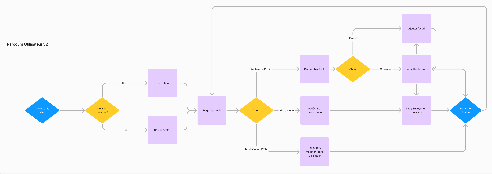
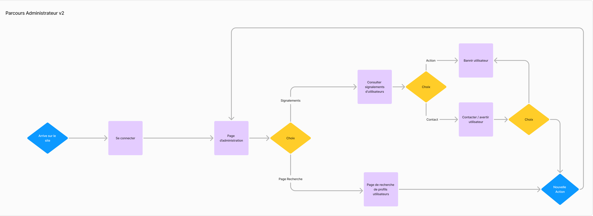
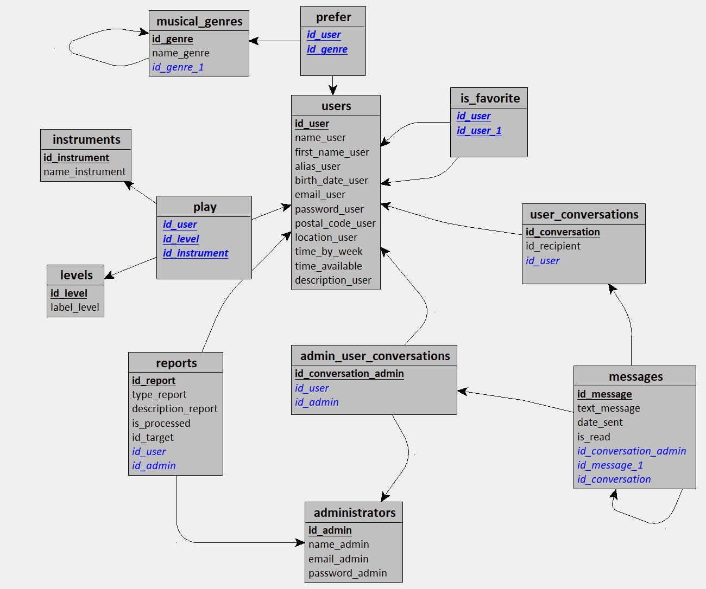
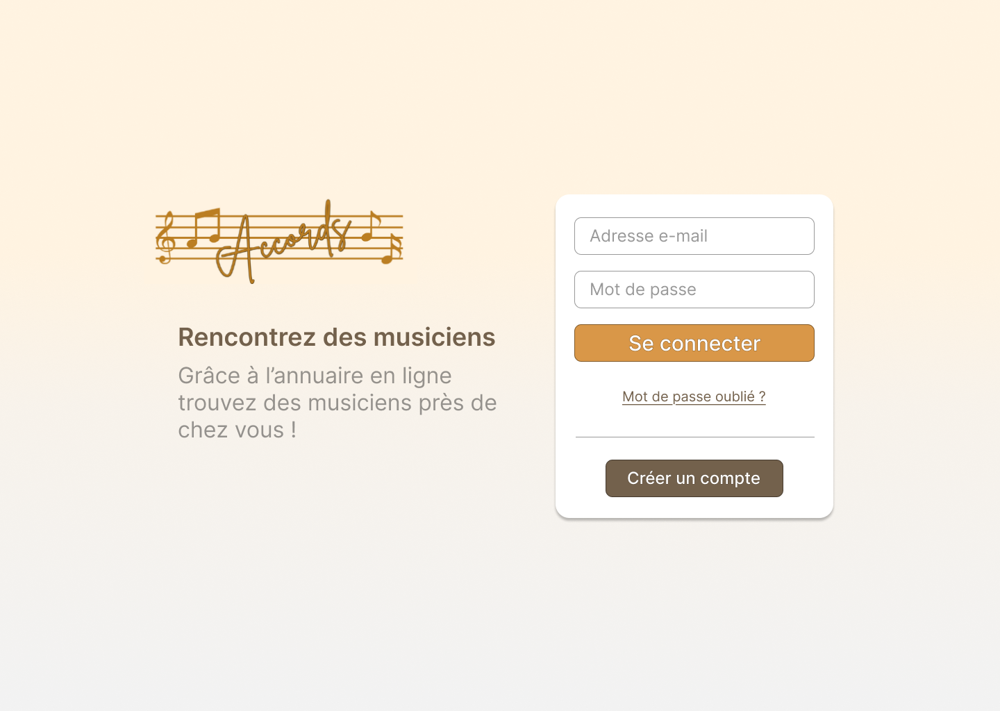
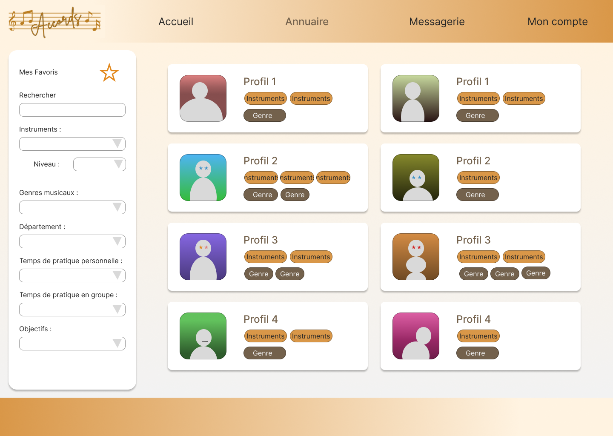
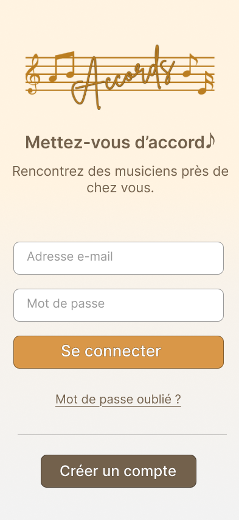
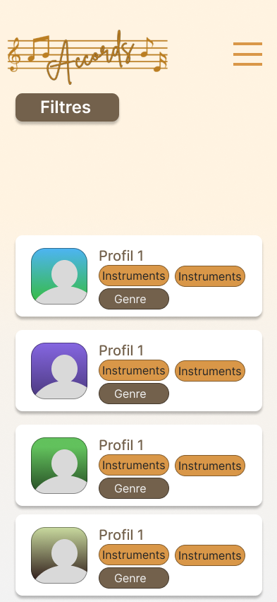

<div style="display: flex; justify-content: center; align-items: center; width: 100%;">
<h1 style="max-width:200px; text-align:center;background: rgb(217,151,72);
background: linear-gradient(90deg, rgba(217,151,72,1) 35%, rgba(115,97,76,1) 100%); border-radius: 20px;filter:drop-shadow(0px 4px 4px rgba(0,0,0,0.25));"> Accords </h1>
</div>


<h2 style="text-align:center;"> Dossier d'analyse </h2>


[TOC]


### I. Présentation


L'application vise à connecter des musiciens partageant des intérêts communs pour jouer ensemble ou former des groupes. 

Elle propose deux types de profils : utilisateurs et administrateurs. 

-Les utilisateurs peuvent s'inscrire, personnaliser leur profil, rechercher d'autres musiciens avec des filtres spécifiques, sauvegarder des favoris, communiquer via messagerie, et signaler des profils problématiques. 

-Les administrateurs  peuvent, eux, gérer les signalements et bannir des utilisateurs si nécessaire. Dans le cadre de la gestion des signalement, ils pourront communiquer avec les utilisateurs et afficher les différents profils selon les mêmes critères de recherche que les utilisateurs.

L'interface est disponible en français et en anglais pour une accessibilité accrue.

<div style="page-break-after:always"></div>


### II. Dictionnaire des données

Les utilisateurs retrouveront dans leur profil leur nom, prénom, pseudo (facultatif), date de naissance, leur code postal et la ville associée, une photo, le temps qu'ils consacrent à la musique et celui qu'il souhaite investir dans la pratique en groupe. Pour s'inscrire et se connecter ils auront besoin d'une adresse mail et d'un mot de passe. Ils pourront également renseigner un ou plusieurs instruments ainsi que leur niveau de pratique pour chacun d'entre eux et ajouter les genre musicaux qu'ils préfèrent.

Les administrateurs devront également se connecter grace à leur adresse mail et mot de passe. Ils sont définis par un nom et une photo.

Un utilisateur peut en ajouter un autre en favori. Les utilisateurs peuvent communiquer entre eux à l'aide de conversations. Chaque conversation a un sujet et rassemble des messages entre deux utilisateurs. Pour chaque message on gardera le texte, la date d'envoi (date + heure) et s'il a été lu ou non. 

Les utilisateurs peuvent également écrire aux administrateurs pour signaler le mauvais comportement d'un autre utilisateur. On renseignera le signalement par son type (propos haineux, insulte, contenu non approprié, harcèlement), une description et si le signalement a été traité. L'administrateur pourra ensuite enquêter auprès du plaignant et du signalé en utilisant le système de conversation afin de prendre la décision adéquate.

| Nom                      | Description                                                | Type          | commentaire                                                  |
| ------------------------ | ---------------------------------------------------------- | ------------- | ------------------------------------------------------------ |
| **users**                |                                                            |               |                                                              |
| id_user                  | identifiant de l'utilisateur                               | SERIAL        |                                                              |
| name_user                | nom de l'utilisateur                                       | VARCHAR(30)   |                                                              |
| first_name_user          | prénom de l'utilisateur                                    | VARCHAR(30)   |                                                              |
| alias_user               | pseudo de l'utilisateur                                    | VARCHAR(30)   |                                                              |
| birth_date_user          | année de naissance de l'utilisateur                        | INTEGER       | vérification de l'entrée importante                          |
| email_user               | email de l'utilisateur                                     | VARCHAR(30)   |                                                              |
| password_user            | mot de passe de l'utilisateur                              | VARCHAR(30)   | Doit être crypté                                             |
| postal_code_user         | code postal de la localité de l'utilisateur                | INTEGER       |                                                              |
| location_user            | nom de la localité de l'utilisateur                        | INTEGER       |                                                              |
| profile_pic_user         | photo de l'utilisateur                                     | VARCHAR(50)   | lien dans la base, image stockée sur le serveur ou hebergée ailleurs (à décider) |
| weekly_personal_practice | temps consacré à la pratique par semaine par l'utilisateur | INTEGER       |                                                              |
| weekly_availability      | disponibilité / souhait pour la pratique en groupe         | INTEGER       |                                                              |
| description_user         | description de l'utilisateur                               | VARCHAR(1000) |                                                              |
| **levels**               |                                                            |               |                                                              |
| id_level                 | identifiant du niveau                                      | SERIAL        |                                                              |
| label_level              | niveau de pratique                                         | VARCHAR(15)   |                                                              |
| **instruments**          |                                                            |               |                                                              |
| id_instrument            | identifiant de l'instrument                                | SERIAL        |                                                              |
| name_instrument          | nom de l'instrument                                        | VARCHAR(30)   |                                                              |
| image_instrument         | photo de l'instrument                                      | VARCHAR(50)   | URL / chemin vers l'image                                    |
| **musical_genres**       |                                                            |               |                                                              |
| id_genre                 | identifiant du genre musical                               | SERIAL        |                                                              |
| name_genre               | nom du genre                                               | VARCHAR(50)   |                                                              |
| **administrators**       |                                                            |               |                                                              |
| id_admin                 | identifiant de l'admin                                     | SERIAL        |                                                              |
| name_admin               | nom de l'admin                                             | VARCHAR(30)   |                                                              |
| email_admin              | email de l'admin                                           | VARCHAR(30)   |                                                              |
| password_admin           | mot de passe de l'admin                                    | VARCHAR(30)   |                                                              |
| profile_pic_admin        | photo de l'admin                                           |               | URL / chemin vers l'image                                    |
| **messages**             |                                                            |               |                                                              |
| id_message               | identifiant du message                                     | SERIAL        | il faudra l'id de l'emetteur                                 |
| text_message             | contenu du message                                         | VARCHAR(500)  |                                                              |
| date_sent                | date d'envoi                                               | DATETIME      |                                                              |
| is_read                  | status du message lu/non lu                                | BOOLEAN       |                                                              |
| **conversations**        |                                                            |               | regroupe les messages                                        |
| id_conversation          | identifiant de conversation                                | SERIAL        |                                                              |
| conversation_subject     | objet de la conv                                           | VARCHAR(30)   |                                                              |
| **reports**              |                                                            |               |                                                              |
| id_report                | identifiant du signalement                                 | SERIAL        | il faudra un idUser emetteur et idUser cible                 |
| type_report              | type de signalement                                        | ENUM          | ('Hate speech', 'Offensive name', 'NSFW Content', 'Harassment') |
| description_report       | objet du signalement                                       | VARCHAR(500)  |                                                              |
| is_processed             | est traité ou non                                          | BOOLEAN       |                                                              |

<div style="page-break-after:always"></div>


### III.  Schémas UML


#### A.  Diagramme de cas d'utilisation


Le diagramme ci-dessus présente les différents cas d'utilisation de l'application par un utilisateur musicien et par un administrateur.


<div style="page-break-after:always"></div>


#### IV.  Diagramme de flux


Voici les actions et les choix que l'utilisateur ou l'administrateur pourra effectuer lors de l'utilisation de l'application Accords.


#### A. Diagramme des Flux Utilisateur





#### B.  Diagramme des Flux Administrateur 




<div style="page-break-after:always"></div>


### V. Schéma relationnel de la base de données


*Ce schéma représente les différentes interactions entre les tables du modèle.*

<div style="page-break-after:always"></div>


### VI. Diagramme de classes


Voici le diagramme des différentes classes qui en résulte.



<div style="page-break-after:always"></div>

### VII. Export Données et structures BDD

Ci-dessous, le script pour créer la base de données en PostgreSQL.

Remarque : Pour la table messages, on vérifie si la conversation qui contient le message est de type admin ou users

```postgresql
DROP DATABASE IF EXISTS accords;

-- ------------------------------------------------------------------------
-- -------------------------CREATION DE LA BASE---------------------------
-- ------------------------------------------------------------------------

CREATE DATABASE accords
    WITH 
    ENCODING = 'UTF8'
    LC_COLLATE = 'fr_FR.UTF-8'
    LC_CTYPE = 'fr_FR.UTF-8'
    TEMPLATE = template0;

-- Connexion à la base de données
\c accords

-- ------------------------------------------------------------------------
-- -------------------------CREATION DES TABLES---------------------------
-- ------------------------------------------------------------------------

-- -----------------------------------------------------------------------
-- Structure de la table users
--  

CREATE TABLE users (
    id_user SERIAL PRIMARY KEY,
    name_user VARCHAR(30) NOT NULL,
    first_name_user VARCHAR(30) NOT NULL,
    alias_user VARCHAR(30) NOT NULL,
    birth_date_user DATE,
    email_user VARCHAR(30) UNIQUE NOT NULL,
    password_user VARCHAR(255) NOT NULL,
    postal_code_user VARCHAR(10),
    location_user VARCHAR(50)
);

-- -----------------------------------------------------------------------
-- Structure de la table instruments
--  
CREATE TABLE instruments (
    id_instrument SERIAL PRIMARY KEY,
    name_instrument VARCHAR(30) NOT NULL
);

-- -----------------------------------------------------------------------
-- Structure de la table levels
--  
CREATE TABLE levels (
   id_level SERIAL PRIMARY KEY,
   label_level VARCHAR(15)
);

-- -----------------------------------------------------------------------
-- Structure de la table musical_genres
--  
CREATE TABLE musical_genres (
    id_genre SERIAL PRIMARY KEY,
    name_genre VARCHAR(30) NOT NULL
);

-- -----------------------------------------------------------------------
-- Structure de la table administrators
--  
CREATE TABLE administrators (
    id_admin SERIAL PRIMARY KEY,
    name_admin VARCHAR(30),
    email_admin VARCHAR(30) UNIQUE NOT NULL,
    password_admin VARCHAR(255) NOT NULL
);

-- -----------------------------------------------------------------------
-- Structure de la table user_conversations
--  
CREATE TABLE user_conversations (
   id_conversation SERIAL PRIMARY KEY,
   id_recipient VARCHAR(50),
   id_user INTEGER NOT NULL,
   FOREIGN KEY (id_user) REFERENCES users(id_user)
);

-- -----------------------------------------------------------------------
-- Structure de la table admin_user_conversations
--  
CREATE TABLE admin_user_conversations (
   id_conversation_admin SERIAL PRIMARY KEY,
   id_user INTEGER NOT NULL,
   id_admin INTEGER NOT NULL,
   FOREIGN KEY (id_user) REFERENCES users(id_user),
   FOREIGN KEY (id_admin) REFERENCES administrators(id_admin)
);

-- -----------------------------------------------------------------------
-- Structure de la table messages
--  
CREATE TABLE messages (
   id_message SERIAL PRIMARY KEY,
   text_message VARCHAR(500),
   date_sent TIMESTAMP,
   is_read BOOLEAN,
   id_conversation INTEGER,
   id_conversation_admin INTEGER,
   id_message_parent INTEGER,
   CHECK (
      (id_conversation IS NOT NULL AND id_conversation_admin IS NULL) OR
      (id_conversation IS NULL AND id_conversation_admin IS NOT NULL)
   ),
   FOREIGN KEY (id_conversation) REFERENCES user_conversations(id_conversation),
   FOREIGN KEY (id_conversation_admin) REFERENCES admin_user_conversations(id_conversation_admin),
   FOREIGN KEY (id_message_parent) REFERENCES messages(id_message)
);
-- -----------------------------------------------------------------------
-- Structure de la table reports
--  
CREATE TABLE reports (
    id_report SERIAL PRIMARY KEY,
    type_report VARCHAR(20) CHECK (type_report IN ('Hate speech', 'Offensive name', 'NSFW Content', 'Harassment')) NOT NULL,
    description_report VARCHAR(500),
    is_processed BOOLEAN,
    id_target_user INTEGER NOT NULL,
    id_source_user INTEGER NOT NULL,
    FOREIGN KEY (id_target_user) REFERENCES users(id_user),
    FOREIGN KEY (id_source_user) REFERENCES users(id_user)
);

-- -----------------------------------------------------------------------
-- Structure de la table prefer
--  
CREATE TABLE prefer (
   id_user INTEGER,
   id_genre INTEGER,
   PRIMARY KEY (id_user, id_genre),
   FOREIGN KEY (id_user) REFERENCES users(id_user),
   FOREIGN KEY (id_genre) REFERENCES musical_genres(id_genre)
);

-- -----------------------------------------------------------------------
-- Structure de la table play
--  
CREATE TABLE play (
   id_user INTEGER,
   id_level INTEGER,
   id_instrument INTEGER,
   PRIMARY KEY (id_user, id_level, id_instrument),
   FOREIGN KEY (id_user) REFERENCES users(id_user),
   FOREIGN KEY (id_level) REFERENCES levels(id_level),
   FOREIGN KEY (id_instrument) REFERENCES instruments(id_instrument)
);

-- -----------------------------------------------------------------------
-- Structure de la table is_favorite
--  
CREATE TABLE is_favorite(
   id_user INTEGER,
   id_fav INTEGER,
   PRIMARY KEY(id_user, id_fav),
   FOREIGN KEY(id_user) REFERENCES users(id_user),
   FOREIGN KEY(id_fav) REFERENCES users(id_user)
);
```


### VIII. Spécifications fonctionnelles et techniques


Le développement de l'application reposera sur une architecture moderne et efficace. 

Le frontend sera construit avec React, offrant une interface responsive et interactive avec des mises à jour de page en temps réel. 

Le backend, basé sur Express, fournira une API REST pour la communication avec le frontend, tandis que la base de données utilisera PostgreSQL. 

La sécurité sera assurée par des JSON Web Tokens, le versionnage par Git, et l'application sera déployée en ligne.

<div style="page-break-after:always"></div>

### IX. Aperçu maquettage

Voici un apercu des pages "Connexion" et "Annuaire" de notre application Accords. 

 ### A. Lors de la navigation sur version web 



Une première version de notre page de connexion ainsi que notre annuaire au format Web. 



<div style="page-break-after:always"></div>

### B. Lors de la navigation sur version mobile



Une première version de notre page de connexion ainsi que notre annuaire au format Mobile. 



